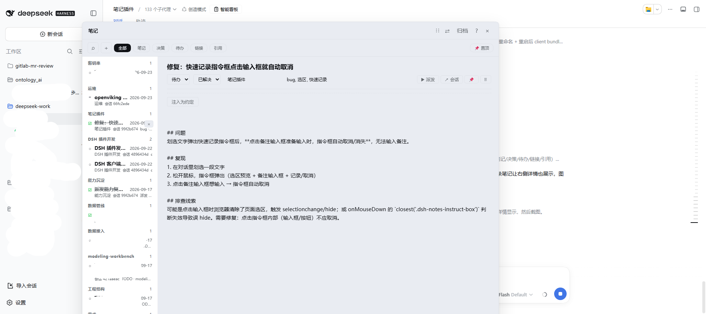

<div align="center">

# 📝 dsh-notes-plugin

**把 Agent 会话里「聊完就丢」的决策与约定，沉淀成本地 Markdown 笔记**

自动注入系统提示 · 可派发待办给活跃会话 · 选区一键摘录 · 纯本地 Markdown 不上传

[](https://www.npmjs.com/package/dsh-notes-plugin)
[](https://www.npmjs.com/package/dsh-notes-plugin)
[](https://www.npmjs.com/package/dsh-notes-plugin)
[](https://github.com/PPawnsir/dsh-notes-plugin/blob/main/LICENSE)




</div>

## 解决什么问题

Agent 会话里的结论是「一次性」的：一个方案为什么这么选、项目有哪些硬约定、下午冒出来的待办，全都散落在对话流里；上下文一压缩、会话一关，这些知识就没了。下一个会话的 agent 不知道上周定过什么，用户也得反复复述约定。

dsh-notes 把这件事变成可积累的本地资产：

| 问题 | 解法 |
| --- | --- |
| 结论聊完就丢 | 面板内 `Enter` 即存为本地 Markdown（`~/.dsh/notes`），选区文字一键摘录，永不出本机 |
| 笔记越记越乱 | LLM 异步识别主题并回填标题/分类，`kind`（笔记/决策/待办/链接/引用）与 `status`（进行中/置顶/已解决/已取代）两个正交维度管理 |
| agent 不知道约定 | 打开「⚡ 注入为约定」开关，笔记内容自动注入 Agent 系统提示（`order 130`），范围可选本工作区 / 全局 / 指定会话 |
| 待办没人执行 | 一键把待办派发给任意**活跃**会话（`Agent.send` 注入「召回上下文 + 具体要求」并唤醒对方开始工作），派发历史可标记完成 |
| 事后找不到 | 面板即时搜索 + 全文兜底并集检索、`note_search` 工具按 tag/topic/kind 过滤、归档按会话或标签合并、软删除可恢复 |

## 安装

> 宿主要求：Node ≥ 22；DSH ≥ `0.1.5-rc.1`（已通过 `peerDependencies` 声明，含预发布分支的版本范围见 package.json）

```sh
dsh plugin --profile web add dsh-notes-plugin
```

重启 DSH 后生效：会话头部出现「**智能笔记**」按钮（✎，带计数徽标），点击打开/关闭面板；桌面角落另有可拖拽的悬浮气泡入口。

## 升级 / 卸载

```sh
dsh plugin --profile web add dsh-notes-plugin@latest   # 升级（重启 DSH）
dsh plugin --profile web remove dsh-notes-plugin       # 卸载（不删数据）
```

## 功能清单

- **快速记录**：顶栏 `＋` 图标（或 `Ctrl+N`）展开输入框，`Enter` 即存、`Shift+Enter` 换行；LLM 异步识别主题并回填标题，不阻塞交互
- **选区记录**：选中页面任意文字浮出「快速记录」按钮，一键存为 `quote` 类型笔记（也可在同一浮层写「备注」，由 LLM 提取标签/类型/注入意图）
- **同会话合并**：10 分钟窗口内的连续速记按时间戳自动合并成一条，避免碎片化
- **类型与状态**：`kind` = 笔记 / 决策 / 待办 / 链接 / 引用；`status` = 进行中 / 置顶 / 已解决 / 已取代（置顶单独分组，已解决降透明度）
- **约定注入**：详情区「⚡ 注入为约定」独立开关（不依赖标签），范围逐级浮层多选——本工作区 / 全局 / 勾选多个会话（会话按工作区分组、显示会话名，自动排除子 agent 与已归档会话）
- **任务派发**：待办一键派发到活跃会话或新建会话，可补充具体要求；派发记录（会话名/要求/时间/是否完成）落在笔记的 `dispatches` 字段里，正文不被污染；目标会话系统提示持续注入该待办直到标记完成
- **检索**：面板搜索框（本地即时过滤 + 250ms 防抖全文兜底，取并集）、kind 筛选 chips、`note_search` 工具
- **键盘流**：`Ctrl+K` 搜索、`Ctrl+N` 新建、`j/k`/`↑↓` 移动、`Enter` 打开、`Esc` 关闭（输入框内不抢键）
- **归档整理**：速记按会话合并、手动笔记按标签合并，原笔记软删除（`.bak` 备份）可恢复
- **Apple Notes 质感**：0 圆角列表项、纯背景选中、hover 才显操作、自动保存（底部提示「已自动保存 HH:MM」）、暗色模式适配
- **性能**：内存缓存（写入同步回填，列表命中零磁盘读）+ 正文按需加载 + 懒加载分页（每屏 50 条）；面板位置/尺寸/列宽持久化到 `localStorage`

## Agent 工具（3 个）

| 工具 | 作用 |
| --- | --- |
| `note_search` | 自由文本 + `tag` / `topic` / `kind` 过滤检索（返回瘦身列表，正文用 `note_get` 取） |
| `note_get` | 按 id 读完整正文 + 全部元数据（含派发历史） |
| `note_manage` | 单一入口 CRUD + 整理 + 派发：`create` / `list` / `update` / `delete` / `restore` / `archive` / `dispatch` |

`note_manage { action: 'dispatch', id, targetSessionId? }`：不传 `targetSessionId` 时返回当前活跃会话列表供选择，传了则把该待办注入目标会话并唤醒它开始工作。

## 数据位置

笔记是 `~/.dsh/notes/` 下的独立 Markdown 文件（YAML front-matter + 正文），**纯本地、不上传**；卸载插件不删数据。

```
~/.dsh/notes/
  n-xxxxxxxx.md        # 一条笔记 = 一个文件
  n-xxxxxxxx.md.bak    # 归档/覆盖时的备份
  perf-report.json     # 面板性能遥测（可随时删除）
```

首次启动若检测到旧的开发版笔记目录（`<repo>/notes/`），会**一次性复制**缺失的文件到 `~/.dsh/notes`（只复制、不删除，同名跳过）。

```yaml
---
id: n-xxxxxxxx
title: 标题
topic: 主题            # LLM 自动识别
workspace: 工作区名     # 取会话 cwd 目录名
tags: tag1, tag2
kind: note             # note/decision/todo/link/quote
status: active         # active/pinned/resolved/superseded
inject: false          # 是否作为约定注入系统提示
injectTo: []           # 注入范围多选：[] = 本工作区 / [global] / [会话短id,...]
createdAt: ISO-8601
updatedAt: ISO-8601
sessionId: 来源会话
cwd: 来源工作目录
dispatches: []         # 派发历史（会话/要求/时间/done）
mergedFrom: []         # 归档合并来源 id
archivedAt: ""
deleted: "false"       # 软删除标记
---

正文 Markdown
```

向后兼容：旧文件缺 `inject`/`kind`/`status`/`injectTo` 字段时自动兜底（无 `inject` 时回退按 `tags` 含 `convention` 判定）。

## 权限与实现

- **Host 端**：`inject: ['fs', 'sandboxPolicy']`，只需笔记读写与写策略；`llm` / `agents` / `systemPrompt` / `sessionPersistence` / `workspaceRegistry` 均按需 `ctx.get` + 存在性守卫，缺失时对应功能降级（如无 LLM 时不自动分类）
- **Client 端**：`inject: ['slots']`，注册 4 个 Slot 注入点——会话头部按钮（`conversation.session.header.actions`，order 40）、悬浮气泡（`shell.overlay` 199）、浮窗面板（200）、选区捕获（201）
- **通信**：client 经 `fetch('/dsh-notes')` POST `{method, args}` 调用 host 的 RPC（19 个业务方法 + 1 个存活探测 `notes-ping`）；样式经 `notes-css` 下发并注入 `<style>`，零外部运行时依赖

## 源码与开发

- 仓库：<https://github.com/PPawnsir/dsh-notes-plugin>
- 本包（`packages/dsh-notes/`）由开发版 bootstrap 插件生成：`index.mjs` 为 host 端 ESM 静态包，`lib/client.js` 由 `scripts/build-dist.cjs` 从 `client-impl.js` 机械转换（带转换计数断言，漏改即中止）
- 回归测试（内存 mock，不触碰真实笔记）：

```sh
node scripts/build-dist.cjs           # 改完 client-impl.js 后刷新 lib/client.js
node --check packages/dsh-notes/index.mjs
node --check packages/dsh-notes/lib/client.js
node check.js                         # 151 例回归（host 全链路 + 静态包 + client UI 面）
```

详见 [DEVELOPMENT.md](https://github.com/PPawnsir/dsh-notes-plugin/blob/main/DEVELOPMENT.md) 与 [tests/e2e.md](https://github.com/PPawnsir/dsh-notes-plugin/blob/main/tests/e2e.md)。

## License

MIT
