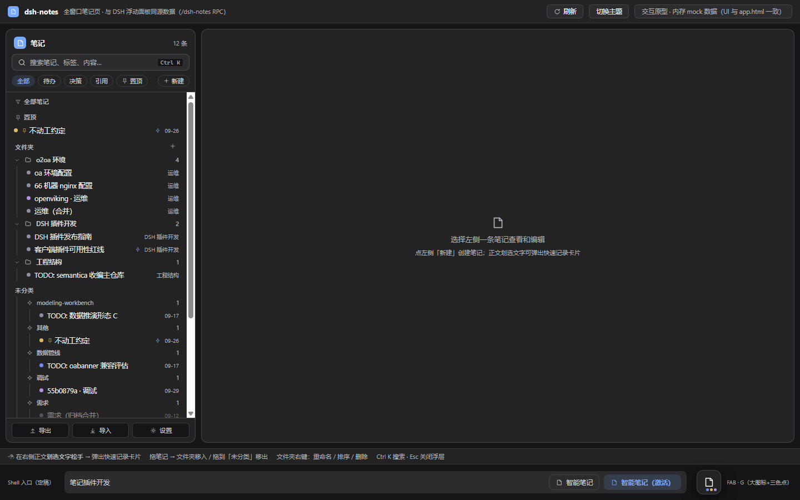
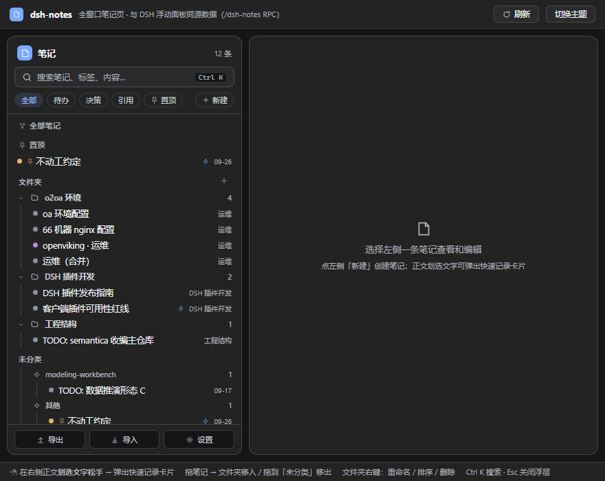

**English** | [中文](README.md)

<div align="center">

# 📝 dsh-notes-plugin

**Turn the decisions and conventions that agent sessions would otherwise "lose the moment the chat ends" into local Markdown notes**

Auto-injected into the system prompt · Dispatch todos to live sessions · One-click selection capture · Pure local Markdown, never uploaded

[](https://www.npmjs.com/package/dsh-notes-plugin)
[](https://www.npmjs.com/package/dsh-notes-plugin)
[](https://www.npmjs.com/package/dsh-notes-plugin)
[](https://github.com/PPawnsir/dsh-notes-plugin/blob/main/LICENSE)




**Interactive demo** <br>


</div>

## Version Compatibility (dsh-notes ↔ DSH)

DSH evolves quickly and each plugin version differs in capability and supported range — **check the table below before upgrading the plugin**. The declared range comes from `peerDependencies` (enforced by npm at install time); the "tested baseline" is the DSH version on which that plugin version was developed and regression-tested:

| Plugin version | Released | Declared DSH range | Tested baseline | Highlights |
| --- | --- | --- | --- | --- |
| **0.4.7** | 2026-10-08 | `^0.1.7 \| 0.2.0-rc.2 \| ^0.2.0` | **0.2.0-rc.2** | Seven cards (live-user testing surfaced 6 real bugs): **scheduler stability** (P0 hotfix for anchored first-fire never firing + same-title dedicated sessions now discriminated by note-id suffix) + **dedicated-session permission preset** (schedule 10th key `preset` — two explicit tiers, passed through to host permissionPresets + dispatch-modal dropdown and "headless session" hint) + **AI-organize overhaul** (busy veil / sticky failure banner / over-limit precheck + adaptive per-model configurable length cap `organizeMaxChars`) + **conflict-check timeout 8s→120s** + **editor data safety** (close-flush of in-flight edits + unified red "load failed" dot + source-mode in-flight lock) + **panel e2e harness** (mock-mounted React panel + vendored React, real-browser panel cases covering the kind-lag/group-paging paths) + UX polish (sticky settings save bar / collapsible descriptions / meta action overflow menu / keyboard-reachable group paging / tri-state ⓘ) + telemetry backoff & slow-RPC diagnostics hook; check 1007→1050 · e2e 231→359 (39 cases) |
| **0.4.6** | 2026-10-07 | `^0.1.7 \| 0.2.0-rc.2 \| ^0.2.0` | **0.2.0-rc.2** | Combined release (includes unpublished 0.4.5; 21 cards + 1 hotfix, driven by UX inspection R2 + live-user reports): **stability hardening** (RPC resilience — 20s timeout / non-blocking slow-bar / landing empty state + rich-text in-flight fake-green-sync root fix: edit lock + "body loading…") + **governance surfaces to topbar** (Suggest button with live count badge + conflict-check shortcut + "core concepts in 30s" in help) + **@-mention notes in composer** (notes candidate group, title search, body inlined) + **convention health check** (LLM pairwise conflict/supersede detection over injected conventions, sensitive masked, suggest-only) + **one-click MD export** + **session-header 📎 injected-list badge** + **scheduling** (edit-misfire root fix via declaredAt re-anchoring + dedicated sessions can pick a model) + **grouped paging** (pinned/folder/unfiled/topic each get "load more (N left)"; global window slice and scroll-load deadlock retired) + **kind filter one-tick lag root fix** (filtersRef ordering defect, explicit param) + dispatch no longer auto-resolves notes + 19 copy/consistency items + 6 suggester-flow breakpoints + check section auto-discovery; check 882→1007 · e2e 231 (31 cases) |
| **0.4.4** | 2026-10-06 | `^0.1.7 \| 0.2.0-rc.2 \| ^0.2.0` | **0.2.0-rc.2** | Eight cards (driven by live-use proposals): **dispatch overhaul** (dispatch receipts as notes — "执行记录 · title" kind=log companion in a dedicated folder, 📤/📥/✅ three views unified, clickable jump on both ends + dormant-session "deliver on next activity" with zero wake + periodic-schedule dedicated session created on first fire and reused after) + **directory supplementary lines removed entirely** (mount lines = sole directory source) + **folder governance** (folder expand = explicit sys entry to browse memory archives + hidden attribute as pure UI mask (show-hidden toggle / right-click hide / jump-to unaffected) + machine-sediment folders sys-hidden by default (work logs / memory archives / exec records, revealed via Machine filter or show-hidden)) + AI organize optional user-instruction modal (prompt byte-identical when empty) + panel-reopen empty-body fix (rich-text uncontrolled DOM rebuild hole, dual gate); check 824→882 · e2e 141 (22 cases) |
| **0.4.3** | 2026-10-05 | `^0.1.7 \| 0.2.0-rc.2 \| ^0.2.0` | **0.2.0-rc.2** | Combined release (includes unpublished 0.4.1/0.4.2 + 14-card main batch + 12-card acceptance-repair batch): **note network kernel** (graph kernel / RootNote hosted sections / onNoteChanged event bus / per-note serial chain / kind=sys) + **three-layer injection pipeline** (payload = injection-index §1 mount lines with human-editable "when to read me" / machine storage = telemetry.json with four disciplines / presentation = directory-section value-signal line) + catalog & reference buckets merged into a single directory section (mount lines as enhanced state, off by default) + whenToUse LLM-prefilled mount modal (modal-first on three entry points, 8s fallback to title) + **work logs on par with regular notes** (visible/searchable/editable/explicitly catalogable, injection hard-off; "file view" & overlay special-path removed, expand lag 64×→1×) + sys machine notes quiet by default (panel "Machine" filter to browse memory archives; archives filed into a real folder) + useCount unified into note-stats facet single source of truth (note_get hot path no longer rewrites .md) + utility ledger three layers (telemetry / signal line / per-memory archive details) + browser e2e suite (17 cases, 90 assertions); check 736→824 |
| **0.3.3** | 2026-10-04 | `^0.1.7 \| 0.2.0-rc.2 \| ^0.2.0` | **0.2.0-rc.2** | Agent memory r3 lane model (convention/memory parallel lanes — enabling no longer asks for overlap-conflict confirmation) + injection manager panel (library-wide injection three-state overview + per-row direct edit + multi-select batch) + settings card interaction feedback (permanent ✕ close + dirty save/revert + fallback flush on close) + internal modularization refactor (client 46 slices / app 40 slices / host dual manifests 45 slice entries, dual-package same-source assemblers byte-equivalent + zero-BOM assertion on the publish surface) + `check --only` section-scoped regression; peer declaration unchanged |
| 0.3.2 | 2026-10-03 | `^0.1.7 \| 0.2.0-rc.2 \| ^0.2.0` | 0.2.0-rc.2 | Pure README re-release (remedy for the 0.3.1 release accident where the README was not synced: filled in missing descriptions for version history / token statistics / nested folders and more), zero code changes |
| 0.3.1 | 2026-10-03 | `^0.1.7 \| 0.2.0-rc.2 \| ^0.2.0` | 0.2.0-rc.2 | Agent memory v0 (kind=log work-log sedimentation + memory-guide onboarding + log hygiene) + snapshot version history + token consumption statistics + virtual folder nesting (maxFolderDepth / recursive subtree / cascade delete) + trash batch & multi-select delete + list resilience; the npm-page README stayed on the 0.3.0 list (remedied in 0.3.2) |
| 0.3.0 | 2026-10-02 | `^0.1.7 \| 0.2.0-rc.2 \| ^0.2.0` | 0.2.0-rc.2 | Major release: dual-mode editor (source ⇄ rich text) + image support + ✨AI organize + explicit archive (preview/undo) + sensitive masking + injection enhancements (staleness/budget/previewer) + trash + usage telemetry + wiki-links/backlinks + single-file export + organize suggester + filter center (~20 items, see the feature list); peer declaration kept unchanged (upper bound `^0.2.0`, conservatively not opening 0.3.x — unverified) |
| 0.2.4 | 2026-09-30 | `^0.1.7 \| 0.2.0-rc.2 \| ^0.2.0` | 0.2.0-rc.2 | DSH 0.2.0 compatibility: the declaration explicitly covers the 0.2.0-rc.2 prerelease (semver prereleases do not match wide ranges and must be enumerated); rename-race guard against body loss; verified loading on a local 0.2.0-rc.2 |
| 0.2.3 | 2026-09-30 | `>=0.1.7 <0.2.0-0` | 0.1.7 | npm page README synced with the repo root (sync-pkg-readme + docs whitelisted) |
| 0.2.2 | 2026-09-30 | `>=0.1.7 <0.2.0-0` | 0.1.7 | Declared range correction: lower bound tightened to the tested baseline 0.1.7 (0.1.5~0.1.6 dispatch list timed out in practice, and 0.2.1 still wrongly declared the old range) |
| 0.2.1 | 2026-09-30 | `>=0.1.5-rc.1 <0.2.0-0` | 0.1.7 | Context injection dual roles (convention/reference) / injection scope drops the workspace dimension (defaults to all sessions) / entry button & color v2 polish |
| 0.2.0 | 2026-09-29 | `>=0.1.5-rc.1 <0.2.0-0` | 0.1.7 | Virtual folders / UI v2 / catalog index injection / import & export / `/dsh-notes-app` / 0.1.7 dispatch performance fix |
| 0.1.2 | 2026-09-25 | `>=0.1.5-rc.1 <0.2.0-0` | 0.1.5~0.1.6 | Basic panel: CRUD / quick capture / dispatch / convention injection / search |
| 0.1.0 | 2026-09-23 | `>=0.1.5-rc.1 <0.2.0-0` | 0.1.5-rc | First npm release |

- **Recommendation**: always use the latest plugin version + a DSH at or above the table's "tested baseline"; below the baseline the RPC surface is not guaranteed complete (e.g. <0.1.7 has the dispatch-list timeout problem — 0.2.0 ships a mitigation, but behavior follows 0.1.7).
- **semver prerelease note**: a prerelease like `0.2.0-rc.2` **does not match** a wide range like `>=0.1.7 <0.3.0-0` (semver rules), so prerelease branches must be enumerated explicitly in the declaration — done this way since 0.2.4.
- When DSH makes a major change (`0.x` minor-version jump), this table is updated after the corresponding plugin adaptation release; the `peerDependencies` upper bound (currently `<0.3.0-0`/`^0.2.0`) is the conservative "not yet verified on the newer DSH" declaration, and lifting it happens with a new plugin release.

## What Problem It Solves

Conclusions inside agent sessions are disposable: why a design was chosen, which hard conventions a project has, the todo that popped up this afternoon — all scattered across the conversation stream. Compress the context or close the session, and that knowledge is gone. The next session's agent doesn't know what was decided last week, and the user has to repeat conventions over and over.

dsh-notes turns this into an accumulable local asset:

| Problem | Solution |
| --- | --- |
| Conclusions vanish when the chat ends | Press `Enter` in the panel to store a local Markdown note (`~/.dsh/notes`); one-click capture for selected text; never leaves your machine |
| Notes get messier as they grow | An LLM asynchronously infers the topic and backfills title/category; two orthogonal dimensions — `kind` (note/decision/todo/link/quote) and `status` (active/pinned/resolved/superseded) — plus virtual folders for filing |
| Agents don't know your conventions and reference material | A three-state segmented control in the detail area — "⚡ Off / Convention / Reference": convention = behavioral rules that must be followed, reference = factual background material (agents pull it on demand); note content is injected into the agent system prompt bucketed by role (`order 130`); scope defaults to all sessions and can be limited to specific sessions |
| Agents don't know what's in the library | Directory section (merged into the single `order 130` injection): mounted lines (`- [[id]] when-to-use: …`) are the sole content source — only explicit mounts enter the section, with a gentle planning nudge in the system prompt; `note_get` fetches the full text of relevant entries, `note_search` finds more (no full-library flat listing since 0.4.4-E) |
| Todos never get executed | One click dispatches a todo to any **live** session (`Agent.send` injects "recall context + concrete instructions" and wakes the target to start work); dispatch history can be marked done |
| Can't find it afterwards | Instant panel search + full-text fallback union search, the `note_search` tool filters by tag/topic/kind, archive merges by session or tag, soft delete is restorable |

## Design Philosophy: The Note Network

dsh-notes is not just "a notes plugin with a panel" — the whole product is **a continuously growing network of note references**: nodes = notes (memory / reference / log / archive / index / todo…), edges = references. Features change endlessly, but their carrier is always a node on this network; every governance surface is a node, and high-frequency writes always land in root notes. Every new feature must first pass the design question: **What are its nodes? What are its edges?** (nodes first, then edges)

The four kinds of edges in the network:

| Edge | Form | Semantics |
| --- | --- | --- |
| Wiki link | `[[id]]` in the body | Evidence (log → memory) / association |
| Soft link | front-matter field (`schedule.runLog`, `refNote`) | Association (companion note points to its host) |
| Index mount | Injection-index §1 line `- [[id]] 何时查我：…` | Mount (index → reference; the primary recall channel) |
| Dispatch mount | `dispatches[].sessionId` | Recall (task → reference = deterministic distribution) |

**Root-index pattern**: machine-produced artifacts never add a new panel — data concentrates in linked companion notes (the RootNote hosted-section framework: anchor section / line format / idempotence / tail trimming; the machine only performs line-level edits inside the section, zero touches outside it). Instances: scheduled-dispatch execution log, memory archive, and the injection index. The ruled exception (0.4.3 acceptance fix ⑤) covers recall metrics: high-frequency machine counters move out of note bodies into the `notes/telemetry.json` machine store (in-memory deltas + 2s debounced atomic flush + capacity gates; single writer = the host process), the legacy recall-telemetry note degrades to a human-readable mirror refreshed by the daily-evaluation cron (zero note writes on the hot path), and metrics surface to the panel through the `notes-recall-stats` RPC. The presentation layer (0.4.3 acceptance fix ⑥): injection assembly appends a value-signal line to the tail of the directory section (`（本周引用：id×count｜零引用候选：id｜截至 HH:MM）` — computed from the in-memory ledger snapshot, an atomic same-version snapshot with the directory rows, mentioning only surviving directory-row ids, silently omitted without a snapshot, ≤200 chars), and the injection-manager panel shows a compact mount-area stats row (mounted N｜week Top｜zero-ref M; click to expand full per-channel stats) — the signal line serves presentation only; correctness or cleanup decisions must go through the full `notes-recall-stats` output or human review (usage-grading red line). The original body is never touched — a convention's body is the dispatch payload; history always goes into the companion note.

**Memory governance tiers** (recall guarantee grading): `inject` full-text injection = strong guarantee; task mount (one whenToUse line in index §1) = medium guarantee · the primary channel. Reference notes are not injected by default — mounting is an explicit action. (The former weak tier — a flat full-library catalog index — was removed entirely in 0.4.4-E: flat listing conflicts with the explicit-mount model.)

**Red lines**: the convention bucket is injected verbatim and untouched; reference notes are not injected by default (mounting opts in explicitly); archive/metrics root notes are never injected (no recursion); work logs are first-class notes (visible / searchable / editable), with a single hard gate — injection is never available (no UI toggle + host-side enforcement).

## Install

> Host requirements: Node ≥ 22; DSH ≥ `0.1.5-rc.1` (declared via `peerDependencies`; see package.json for the version range including prerelease branches)

```sh
dsh plugin --profile web add dsh-notes-plugin
```

Takes effect after restarting DSH: a "**Smart Notes**" button (✎, with a count badge) appears in the session header — click to open/close the panel; there is also a draggable floating bubble entry in the corner of the desktop.

## Upgrade / Uninstall

```sh
dsh plugin --profile web add dsh-notes-plugin@latest   # upgrade (restart DSH)
dsh plugin --profile web remove dsh-notes-plugin       # uninstall (data is kept)
```

## Feature List

- **Quick capture**: the top-bar `＋` icon (or `Alt+N`) expands the input box — `Enter` saves, `Shift+Enter` inserts a newline; an LLM asynchronously infers the topic and backfills the title without blocking interaction
- **Selection capture**: select any text on the page and a floating "quick capture" button appears — one click stores it as a `quote` note (you can also write a "remark" in the same popover and let the LLM extract tags/kind/injection intent)
- **Same-session merge**: consecutive quick captures within a 10-minute window are auto-merged by timestamp into one note, avoiding fragmentation
- **Kind & status**: `kind` = note / decision / todo / link / quote; `status` = active / pinned / resolved / superseded (pinned notes are grouped separately, resolved notes are dimmed)
- **Virtual folders (nestable)**: the sidebar note tree is organized as "📌 Pinned / 📁 Folder tree / Unfiled notes"; folders nest (right-click "New subfolder" or drag to re-parent; depth cap `maxFolderDepth` defaults to 3 levels, adjustable / 0 = unlimited, cycles auto-rejected); folder views and counts use the **recursive subtree** caliber (clicking a parent folder shows all descendant content); deleting a folder deletes its children with it (the confirm states "N subfolders + M notes move to the trash (restorable); the folder structure is not restorable", and restored notes whose original folder no longer exists fall back to unfiled); right-click offers rename / move up-down (swap among siblings) / move back to root; the manifest persists in `folders.json` (`parent` field, zero migration for existing data), selection state in `localStorage`
- **Snapshot version history**: before every save, the previous version is auto-snapshotted into `.history/<id>/` (tiered retention: every version within 1 hour / hourly for the current day / daily within 7 days; 20-version cap per note + a global 50MB LRU); the detail area's "History" panel lists versions (time/bytes), opens read-only previews, and restores with one click — the current version is auto-snapshotted before restoring, **so a restore is itself undoable** (just roll back again)
- **Panel UI v2**: two-column layout — left note tree (pinned / folders / unfiled grouped by topic; the "topic filter" applies globally across folders), right full-width editor (title + topic/tags/kind/status meta chips editable in place); SVG icon library + DSH design-token colors, light/dark theme adaptive; quick capture card v2 (selection preview + copy/save/cancel — a successful copy closes the card)
- **Bilingual UI (Chinese / English)**: the settings card "Language" row switches the UI between 中文 and English (persisted in localStorage, Chinese by default, full re-render on switch); runtime flat dictionaries `src/i18n/zh.js` + `en.js` (single source shared by both client states) with `t(key, { name })` interpolation — a missing key falls back to the Chinese original and never leaks a raw key; check.js runs a resident i18n guard (zh/en key-set equality + duplicate-key defense + two-way dictionary↔code reference coverage + product dictionary spot checks) and prints an advisory "uncovered list" of remaining inline-Chinese files at the report tail (non-blocking); host-side RPC error messages stay Chinese in this release
- **Context injection (dual roles)**: the detail area's three-state segmented control "⚡ Off / Convention / Reference" (independent fields `inject` + `injectRole`, not tag-based) — convention = behavioral rules that must be followed (injected into the "user conventions" bucket every turn), reference = factual background material (the "reference material" bucket, pulled on demand when relevant to the current task); the scope popover is multi-select — inject into all sessions by default, tick specific sessions to restrict to them (sessions grouped by workspace and shown by name; sub-agents and archived sessions auto-excluded)
- **Directory section (since 0.4.3 merged with the reference bucket into a single directory section; mounted lines are the sole source since 0.4.4-E)**: a lightweight listing beside full-note injection = mounted lines (`- [[id]] when-to-use: …` from injection index §1) — reference material = explicit mount; unmounted notes are no longer listed flat (0.4.4-E removed "directory supplements unmounted entries": a flat full-library listing conflicts with the explicit-mount model; the `catalogEnabled` master switch / preview badge / catalog telemetry tap retired with it, and a leftover key in settings.json is an inert dead key, never migrated; the `recall` field lost its last consumer and stays dormant with read/write compatibility); mounted lines ride in the same `order 130` injection as conventions (the former standalone `order 131` block is retired) with a gentle planning nudge and a `note_get` mount hint; when the injection budget squeezes, mounted lines drop oldest-first; the section tail carries a work-log count line and a value-signal line (0.4.3 acceptance fix ⑥: `（本周引用：id×count｜零引用候选：id｜截至 HH:MM）`, computed from the in-memory ledger snapshot as an atomic same-version snapshot with the directory rows, silently omitted without a snapshot)
- **Injection manager panel**: settings card "Injection Manager → Manage…" — a library-wide injection three-state overview (convention N / reference M / not-injected K stat chips that filter on click + 250ms debounced search); per-row three-state segmented direct edit (semantics exactly identical to the detail-area control; since 0.4.3 acceptance fix ⑪, switching a single row to "Reference" first opens the whenToUse edit dialog — LLM draft prefill, the index line lands and the note flips to reference only on confirm, cancel is side-effect free; the detail-area three-state control uses the same flow); multi-select batch "Set as convention / Set as reference / Turn off injection" (confirm-gated, per-item failure counting does not interrupt; batch "Set as reference" stays silent with default mount lines whenToUse = title); injecting entries first (convention > reference), sorted by update time descending within groups; logs are inject-hard-gated (no per-row injection toggle — a static "logs never inject" label instead — and not batch-selectable; host-side injectForcedOff enforcement as a second guard), sensitive-note rows hint that injection auto-masks, and an ever-injected badge shows the sticky flag; a mount-area stats row (0.4.3 acceptance fix ⑥: mounted N｜week Top｜zero-ref M, reusing the `notes-recall-stats` ledger snapshot, click to expand full per-channel recall rates, silently omitted without a snapshot)
- **Settings card interaction feedback**: a permanent ✕ close in the title bar + dirty-state "Save" (explicit confirmation: all numeric fields are validated first, then only keys whose "control value ≠ persisted value" are written serially) / "Revert" (rolls back to the snapshot taken on open); closing via ✕/Esc/mask click with unpersisted changes auto-flushes as a fallback and confirms via toast; the existing save-on-select / save-on-blur auto-save is unchanged
- **Task dispatch**: one click dispatches a todo to a live session or a new session, with optional concrete instructions; dispatch records (session name/instructions/time/done) live in the note's `dispatches` field without polluting the body; the target session's system prompt keeps injecting the todo until it is marked done; DSH 0.1.7 adaptation — the live-session list goes through the session metadata cache (on a miss it returns a placeholder + `titlesPending`, and the frontend polls every 1.5s to fill in), cutting load time from 128s to 0.2s
- **Scheduled dispatch (a convention is a schedule)**: a `contractType: dispatch-schedule` convention note + a structured front-matter `schedule` declaration (`{at|every, target, action, enabled, anchor?, dow?}` — natural-language parsing is forbidden) — the host runs a resident 30s cron tick (`unref` so it never holds the process, reload-safe against double runs, catch-up evaluation on startup), and when due it reuses the full dispatch pipeline to auto-dispatch (the dispatch card's source is labeled "Scheduled @title", and receipts close the loop through the existing chain); three-layer state = front-matter `schedule.lastFiredAt/lastRun/lastError` (machine read/write) + the existing `dispatches` history array; **execution-record companion note (runLog soft link, 0.4.4-A three-tables-in-one)**: on dispatch success a "执行记录 · @title" note is lazily created (kind=log work-log type — injection hard-disabled, still visible/searchable/editable as usual, filed in the dedicated「执行记录」folder), the convention's front-matter `schedule.runLog` stores its id as a soft link (non-schedule dispatch sources use a top-level `runLog` field; manual dispatch 📤 / receipt 📥 / manual close ✅ lines append line-wise into the same note), and both the detail plan block and the meta dispatch-history rows offer a "Run log ↗" jump — the convention body is never touched (the body is the dispatch payload; appending history would pollute the next dispatch context), entries newest-first trimmed to ≤50, idempotent dedupe by msgId, and deleting the convention does not cascade-delete the run log (kept for the record); the idempotency lifeline = `lastFiredAt` is persisted before dispatching — a one-shot `at` missed while stopped fires once on startup, a missed recurring tick aligns to the next cycle without catching up; anchored time (recurring mode optionally takes `anchor: 'HH:MM'` local time + weekly `dow: 0-6`): first fire = the next local anchor time, and the firing sequence is pinned to that time of day without drifting from creation/fire times — existing declarations without `anchor` keep pure-interval semantics (zero migration); write red lines: `at` must be in the future / recurring interval ≥5min / `anchor` strictly HH:MM and requires a whole-day interval / `dow` 0-6 and weekly only / target session alive / `runLog` must be an existing note id or empty / unknown fields rejected
- **Search**: the panel search box (instant local filtering + 250ms debounced full-text fallback, unioned), the filter center (a "Filter(N)" button + grouped popover — the status group pinned/injected/ever-injected/sensitive and the kind group of five kinds are all multi-select, OR within a group and AND across groups, active-condition chips individually removable, ever-injected feature-detected via the slim field; an independent sort control time/references/relevance, conditions and sort persist), and the `note_search` tool
- **Keyboard flow**: `Ctrl+K` search (`↓` inside the box jumps straight to the first hit in the list, keeping the filter context), `Alt+N` new note (`Ctrl+N` is the browser-reserved "new window" key and has been dropped), `j/k`/`↑↓` move the focused row (visible highlight), `Enter` opens, `Esc` layers (close popover → clear search and refocus the list → close the panel); typing in inputs never gets hijacked; same behavior in the floating panel and the full-window page (`/dsh-notes-app`)
- **Explicit archive**: the title-bar "Archive" first runs a dry-run preview (`notes-archive-preview`, with an onboarding bubble), and quick-capture groups merge only after you tick them (`notes-archive` whitelisted groups — the host fully validates before acting; the toast can undo once via `notes-archive-undo`); manual notes are excluded from auto-grouping (mis-merge protection) — use the list's "Select" multi-select to merge them; original notes are soft-deleted (`.bak` backup) and restorable
- **Organize suggester**: settings card "Organize Suggestions" — `notes-suggest` dry-run, zero writes, nominates six candidate classes: quick-capture archive groups / stale unreferenced (kind=note/link older than `staleDays` and never hit by `note_get`) / orphan notes (ordinary notes with no `[[wiki-link]]` outlinks or backlinks, not injected, zero references) / log hygiene (agent memory v0: weekly aggregation beyond 7 days + monthly aggregation beyond 90 days) / zero-signal mounts (0.4.5-C telemetry-driven: §1 mounted notes with zero events across the five channels — inject/dispatch-mount/search/get/catalog — in the last 14 days, mounts younger than the window exempt; actions: unmount (note kept) or edit text) / hot but unmounted (0.4.5-C: active notes/links fetched+searched ≥3 times in the last 14 days and not mounted, same exemptions as orphans; action: mount with LLM-prefilled text); it only nominates, never executes — jump straight to archive preview / batch soft-delete (no confirm, toast-undoable) / orphans are display-only with per-item jumps / log hygiene only expands details / the two telemetry classes reuse existing channels (unmount = turning injection off which removes the mount line; mount = MountModal) and silently degrade to empty when telemetry is unavailable
- **Agent memory v0 (work-log sedimentation, r3 lane model)**: the settings card "Agent Memory" section "Enable sedimentation guide" — creates a prefilled convention note (`inject=true`, `contractType: memory-guide` contract identity marker (with `tag memory-guide` as a compatible discovery key), three scope tiers), guiding agents to write session conclusions as `kind=log` work logs when a task wraps up or when you say "jot down today's work" (four-section template: what was done / changes / leftovers & follow-ups / linked notes); the lane model: agent memory is a parallel lane independent of note conventions — conventions govern how you take notes (for humans to read), memory governs what the agent sediments for itself (self-recall); both may apply to the same event with no overlap check / conflict confirmation; logs produced while the guide is active get `origin: memory-guide` in front-matter for provenance; logs are first-class notes (since 0.4.3⑦: visible in default lists/search, openable and editable like any note), `inject` hard-off (no panel toggle + host enforcement), and never nominated by stale/orphan cleanup; out-of-window old logs are nominated for aggregation by workspace×week/month in the suggester's "log hygiene" section (nominate only, window adjustable in the settings card); disabling = turning off that convention's injection (spec: `design/agent-memory-v0.md`)
- **Dual-mode editor (source ⇄ rich text)**: toggle via the two-segment switch on the meta row or `Ctrl+/` — rich text is a restricted WYSIWYG (whitelist: h1-h3 / lists / quotes / fenced code blocks / bold-italic / inline code / links (http/https only) / images / wiki-links; render ⇄ serialize round-trips losslessly, writing back to source with a 900ms debounce); rich-text toolbar (bold/italic/link/image) + paste-HTML whitelist sanitizing (h4-6 demoted to paragraphs, script/style dropped); when the body contains syntax outside the whitelist, the rich-text entry is greyed out with a banner explaining why, and recovers once cleaned
- **Relaxed rich-text gate**: inline HTML (`<b>`/`<i>` etc.) renders literally, GFM tables render read-only (`contenteditable=false` atomic islands, serialized back verbatim) — no more whole-document downgrade; only ambiguous structures like multi-line HTML blocks / nested quotes disable rich text
- **✨ Organize (AI rewrite by template)**: the "Organize" button on the editor meta row — the current draft goes through `notes-ai-organize` (the same LLM channel as `notes-quick-instruct`) and is structurally rewritten per `kind` template (decision → background/conclusion/rationale, todo → checkboxes, link → link/description, quote → quote block/source, machine/ops info → environment/machine list/accounts/portals); after replacement it flows through auto-save, and the toast can undo once; bodies over 12000 characters error out with guidance to split
- **Kind template skeletons**: new notes are prefilled per kind (same templates as above; `note` is free-form empty) — the panel's new-note modal lets you pick a kind, and the full-window page follows the filter center's kind group (prefills with that kind when exactly one is selected)
- **Image support**: bodies reference `` relative paths (files land in `assets/`), with three upload entries — paste / drag-drop / toolbar button (`notes-asset-upload`: mime whitelist png/jpeg/gif/webp, ≤5MB; `GET /dsh-notes/asset` serves `` loads, path-traversal-proof); PNG/JPEG over 1MB are downgraded client-side on a canvas to JPEG before upload (long edge ≤2560px, quality ladder 0.85→0.45, transparent backgrounds painted white; GIF/WebP untouched to preserve animation/transparency), and the upload dialog shows "compressed: before → after"; archive backups and import/export carry assets along
- **Asset cleanup**: settings card "Asset Cleanup" — `notes-assets-prune` scans `assets/` for orphan files not referenced by any note body (references from deleted notes still count as protected — better keep than delete), and deletes only after you tick them in the dry-run preview; the published static package performs real deletion, while the dev build clears placeholders (0-byte tombstones)
- **Trash**: the sidebar-bottom "Trash" (same entry in the panel and the full-window page) — lists soft-deleted notes (`notes-list` parameterized `includeDeleted`), supporting **select-all/multi-select + batch restore / batch permanent delete** (the confirm states "not recoverable (including version history)", with re-entry protection while running); click a title for an inline **read-only body preview** (Markdown rendered, zero injection surface); per-item "Restore" (`notes-restore`) or "Permanently delete" (`notes-purge`, double-confirm "permanent deletion is not recoverable"); permanent deletion is limited to already-soft-deleted notes (host safety gate), and removes the `.md`, the archive backup `.md.bak`, and the `.history/<id>` snapshot history together — the published static package performs real deletion, the dev build clears placeholders (0-byte tombstones, treated as nonexistent across the whole chain)
- **Multi-select batch operations**: the list's "Select" enters multi-select mode with a bottom action bar "N selected | Merge | Delete | Cancel" — merge goes through archive preview, delete soft-deletes into the trash (no confirm, toast-undoable; confirmation strength = irrecoverability: soft delete is light-confirm, permanent delete keeps the double confirm), buttons disabled at 0 selections
- **Sensitive note masking**: a 🔒 toggle on the editor meta row (`sensitive=true`) — when injected into the system prompt, the body is masked line by line (keys and structure kept, values hidden as `******（敏感，note_get <id> 获取）`, so the agent must `note_get` for the original); password/secret patterns are auto-detected — quick captures land directly as `sensitive=true`, manual creates return a `sensitiveSuggested` hint (not enforced)
- **Injection enhancements**: injection size budget (`injectBudgetChars` character budget, truncated with an annotation when exceeded) + the settings card "Injection Preview" (`notes-inject-preview` renders the injection product in real time + masking/truncation stats, three perspectives: global default / workspace union / single-session filter) + the `injectEver` ever-injected sticky flag (only rises, never unset — drives the filter center's "ever injected" and list-row badges). The staleness threshold `staleDays` (default 90 days, 0 = off) no longer annotates injections since 0.4.4-E (the catalog-row ⚠ suffix was removed together with "directory supplements"); it only drives the organize suggester's "stale unreferenced" nominations
- **Wiki-links & backlinks**: `[[id or title]]` links in the body (exact id match first, then exact title match across the library, unresolved stays plain text) — wiki-link marks at list-row ends, click-to-jump to the target note inside rich text, and a "Backlinks" panel in the detail area listing every other entry in the library pointing to the current note (lazy library-wide index, shows "indexing…" while cold)
- **Import / Export**: entries in the settings card "Data" section — a full-library directory snapshot (including `folders.json`, not packed or compressed — the directory *is* the format; `.history` version history is excluded by default, pass `includeHistory: true` to the `notes-export` RPC to include it); "Export single file…" concatenates notes by scope (all/folder/tag) into one self-contained Markdown (each piece = title + metadata block + body, optional table of contents, images inlined as base64, directly shareable; a single file over 20MB warns but still exports); import is two-step: preview first (new/same/different classification + folder merge stats) then execute — conflicts with different content are skipped by default and overwritten only when ticked; auto-backup before executing (including `.history`), add/modify only, never delete; imported `.history` merges only along with notes that are new to the library (same-id conflicts skip history merging, so the two libraries' histories never mix)
- **Token usage statistics**: the settings card "Usage" section — real usage metadata metering on the LLM channel (StreamChunk `usage` field, falling back to character estimation marked "approx." when metadata is absent), current-month usage / all-time total / `usageBudgetMonthly` monthly budget reminders (tiered toasts when approaching and exceeding); stats land in `usage.json`, RPC `notes-usage-get`
- **Apple Notes feel**: zero-radius list items, plain-background selection, hover-only actions, auto-save (bottom hint "Auto-saved HH:MM"), dark mode adaptation
- **Semi-standalone app**: open `/dsh-notes-app` directly in the browser (same origin as DSH Web — just replace the path of the DSH page address with `/dsh-notes-app`) for the full-window notes page — the in-package `app.html` shares UI v2 and the same RPC data layer with the panel, so you can manage notes outside any session (capture / folders / dispatch / import & export / settings all available)
- **Performance**: in-memory cache (writes backfill synchronously, list hits read zero disk) + on-demand body loading + lazy pagination (50 per screen); panel position/size/column widths persist to `localStorage`
- **Modular engineering structure (for developers)**: the single source of truth for all three ends is sliced by domain — client 46 slices / app 40 slices / host dual manifests 47 slice entries (manifests concatenate in order byte-for-byte, zero insertion and zero rewriting; 7 slices shared by both packages from a single source, divergent slices registered as `.dist.js` variants); `scripts/concat-*.cjs` dual-package same-source assemblers + `build-dist.cjs` refresh all four artifacts at once (`lib/client.js` + `lib/styles.css` + `app.html` + `index.mjs`); check enforces the modular structure contract (ordering / same-source / variant registration assertions) + a zero-BOM assertion on the publish surface (defends against the accident where DSH silently skips the plugin); `node check.js --only=39,42` runs section-scoped regression (the `CHECK_ONLY` environment variable works the same)

## Agent Tools (3)

| Tool | Purpose |
| --- | --- |
| `note_search` | Free-text + `tag` / `topic` / `kind` / `folder` filtered search (`folder` accepts a folder id or exact name, `""` = unfiled; returns a slim list — fetch bodies with `note_get`) |
| `note_get` | Read the full body + all metadata by id (including dispatch history) |
| `note_manage` | Single-entry CRUD + organize + dispatch + move: `create` / `list` / `update` / `move` / `delete` / `restore` / `archive` / `dispatch` |

`note_manage { action: 'move', id, folder }`: move a note into a virtual folder (`folder` accepts a folder id or exact name, `""` = move out to unfiled; an unknown folder errors out directly, never writing a dangling reference). Folder create/rename/delete/reorder itself is managed by the panel's `notes-folders` RPC.

`note_manage`'s `create` / `update` also accept `injectRole` (`'convention'` / `'reference'`, meaningful only with `inject: true`, defaults to `convention`): `convention` = behavioral rules that must be followed (the "user conventions" bucket), `reference` = factual background material (the "reference material" bucket, agents pull it on demand); suggested by `kind` — `decision`/`todo` → `convention`, `note`/`link`/`quote` → `reference`.

`note_manage`'s `create` / `update` also accept `recall` (boolean, default `true`): a **deprecated compatibility field (write side retired in 0.4.5-A)** — it used to control catalog index injection, a feature removed entirely in 0.4.4-E (mounted lines are the sole directory-section source); the argument is still accepted and existing front-matter recall lines are still parsed (read/write compatible — existing data is neither migrated nor deleted), but new writes no longer persist the field, and it has no effect on injection (notes stay searchable via `note_search` regardless).

`note_manage { action: 'dispatch', id, targetSessionId? }`: without `targetSessionId` it returns the current live-session list to choose from; with it, the todo is injected into the target session and the session is woken up to start work.

## Data Location

Notes are independent Markdown files under `~/.dsh/notes/` (YAML front-matter + body), **purely local, never uploaded**; uninstalling the plugin does not delete data.

```
~/.dsh/notes/
  n-xxxxxxxx.md        # one note = one file
  n-xxxxxxxx.md.bak    # backup on archive/overwrite
  .history/            # snapshot version history (auto-snapshots the previous version before each save; see "Version history")
    n-xxxxxxxx/        # one directory per note
      2026-09-17T06-02-34.123Z.ab1.cd2.md   # <UTC timestamp>.<content hash>.md (plain text, not compressed or encrypted)
  assets/              # image assets (base64 text on disk; bodies reference them as  relative paths; orphan assets can be cleaned via "Settings → Asset cleanup")
  folders.json         # virtual folder manifest [{id, name, order}] (missing/corrupt falls back to an empty manifest without affecting the note main flow)
  settings.json        # panel settings (LLM model options, staleDays staleness threshold, injectBudgetChars injection budget, etc.; catalogEnabled is an inert dead key since 0.4.4-E — feature removed, leftovers not migrated)
  perf-report.json     # panel performance telemetry (safe to delete anytime)
```

**Version history (snapshot-based)**: before every save lands on disk, the host auto-snapshots the replaced previous version into `.history/<note id>/` (aligned with the editor debounce — one real save = one snapshot; repeated saves without change are deduped by content hash and skipped). Retention policy: every version within 1 hour → hourly for the current day → daily within 7 days → evicted beyond 7 days; at most 20 versions per note; a global 50MB budget for the whole `.history` (oldest snapshots evicted across notes when exceeded). The trash's "Permanently delete" also wipes the note's entire history tree. History is a local safety net: export does **not** include `.history` by default (pass `includeHistory: true` to the `notes-export` RPC to include it), the pre-import auto-backup always includes history, and import merging carries history only for notes that are new to the library (same-id conflicts skip it — the two libraries' histories never mix).

On first startup, if the old dev-version notes directory (`<repo>/notes/`) is detected, missing files are **copied once** into `~/.dsh/notes` (copy only, nothing deleted, same-name skipped).

```yaml
---
id: n-xxxxxxxx
title: Title
topic: Topic            # auto-inferred by the LLM
workspace: workspace    # directory name of the session cwd
folder: ""             # virtual folder id (in the folders.json manifest); "" = unfiled
tags: tag1, tag2
kind: note             # note/decision/todo/link/quote
status: active         # active/pinned/resolved/superseded
inject: false          # whether to inject into the system prompt (injection is the context master switch)
injectRole: convention # injection role (persisted/effective only when inject=true): convention = behavioral rules that must be followed / reference = factual background material (agents pull on demand); defaults to convention
injectTo: []           # injection scope multi-select: [] = all sessions (default) / [session short-id,...] = only these sessions (legacy global/workspace values tolerated as all sessions)
                       # (the recall line is retired: no longer written since 0.4.5-A; recall lines in existing files are kept and still parsed, with no injection effect)
injectEver: false      # ever-injected sticky flag (once inject was set true, stays true forever; read-only)
sensitive: false       # sensitive note (body masked line by line when injected)
useCount: 0            # usage telemetry (note_get hit count, persisted with 60s debounce)
createdAt: ISO-8601
updatedAt: ISO-8601
sessionId: source session
cwd: source working directory
contractType: ""        # contract typing ("" = ordinary note; dispatch-schedule = scheduled-dispatch convention; other values are managed by internal system flows)
schedule: {...}        # scheduled-dispatch declaration + machine state (persisted only when contractType=dispatch-schedule, single-line JSON: {at|every, target, action, enabled, anchor?, dow?, lastFiredAt?, lastRun?, lastError?, runLog?}; anchor='HH:MM' pins the local time, dow=0-6 weekday for weekly; runLog = soft link to the execution-record companion note id ("执行记录 · @title", kind=log in the 执行记录 folder), lazily created and written back on dispatch success)
dispatches: []         # dispatch history (session/instructions/time/done)
mergedFrom: []         # source ids merged by archive
archivedAt: ""
deleted: "false"       # soft-delete flag
---

Body Markdown
```

Backward compatibility: old files missing `inject`/`kind`/`status`/`injectRole`/`injectTo`/`folder`/`recall`/`sensitive`/`injectEver`/`useCount` fall back automatically (`folder` defaults to unfiled; `recall` defaults to true; `injectRole` defaults to `convention`; `sensitive`/`injectEver` default to false; `useCount` defaults to 0 — zero migration for existing notes; without `inject`, it falls back to detecting `convention` in `tags`). A `folder` pointing at an id outside the manifest (e.g. folders.json corrupted or externally mangled) is treated as unfiled, and deleting a folder actively clears the `folder` of its notes back to unfiled.

## Permissions & Implementation

- **Host side**: `inject: ['fs', 'sandboxPolicy']` — only notes read/write and write policy are needed; `llm` / `agents` / `systemPrompt` / `sessionPersistence` / `workspaceRegistry` are all fetched on demand via `ctx.get` + existence guards, degrading the corresponding feature when missing (e.g. no auto-classification without an LLM)
- **Client side**: `inject: ['slots']` — registers 4 Slot injection points: session header button (`conversation.session.header.actions`, order 40), floating bubble (`shell.overlay` 199), floating panel (200), selection capture (201)
- **Communication**: the client calls the host RPC via `fetch('/dsh-notes')` POST `{method, args}` (note CRUD / search / archive / dispatch / import & export / settings / `notes-folders` folder management + 1 liveness probe `notes-ping`); styles are delivered via `notes-css` and injected as a `<style>`, zero external runtime dependencies; the host also registers a `GET /dsh-notes-app` page route that directly returns the in-package `app.html` (text/html, non-GET/HEAD → 405)

## Source & Development

- Repository: <https://github.com/PPawnsir/dsh-notes-plugin>
- This package (`packages/dsh-notes-plugin/`) is generated from the dev-version modular sources: `index.mjs` is the host-side ESM static bundle (`src/host/**` concatenated per `manifest.dist.js` and written to disk), `lib/client.js` is mechanically transformed by `scripts/build-dist.cjs` from the `src/client/**` concatenation product (with transformation-count assertions that abort on any miss), and `app.html` is the `/dsh-notes-app` full-window notes page (`src/app/**` concatenation product; it shares the same UI/interaction with the `design/notes-ui-v2.html` prototype — only the data layer differs)
- Regression tests (in-memory mocks, real notes untouched):

```sh
node scripts/build-dist.cjs           # after changing src/** (client/host/app/shared/styles), refresh all four artifacts at once: lib/client.js + lib/styles.css + app.html + index.mjs
node --check packages/dsh-notes-plugin/index.mjs
node --check packages/dsh-notes-plugin/lib/client.js
node check.js                         # 1050-case regression (host full chain + static package + client UI surface + virtual folders + directory-section mount lines + import & export + semi-standalone page + dual-mode editor + sensitive masking + injection enhancements + telemetry/wiki-links + snapshot history engine + modular structure contract + bilingual README.en + i18n guard + note-network guard / README philosophy)
npm run e2e                           # Browser e2e (Playwright + built-in mock host, 39 cases / 359 assertions: load/CRUD/search/injection manager & mount modal/log parity/drag-to-folder/trash/export/machine-filter archive browsing/folder sys/hidden visibility/dormant dispatch/exec-log jump/organize modal, etc.; requires chromium or system Chrome)
```

See [DEVELOPMENT.md](https://github.com/PPawnsir/dsh-notes-plugin/blob/main/DEVELOPMENT.md) for details.

## License

MIT
